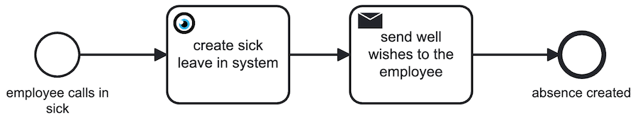
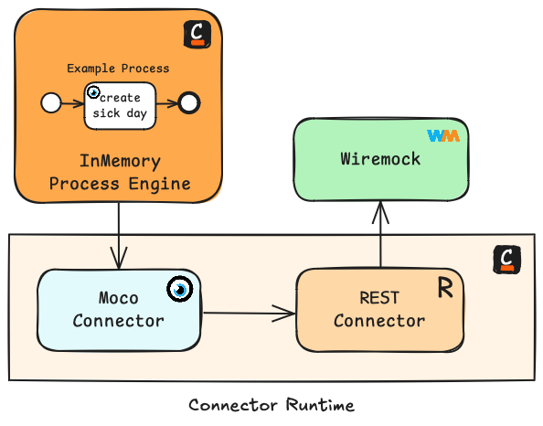

# The Camunda Moco Connector

A connector to talk to the MOCO App API. MOCO is a lightweight ERP software. Check out https://www.mocoapp.com

  

The connector is based on Camunda's out of the box REST connector (v8.5+). Features will be added one by one, if you need anything reach out to me.

NOTE: I am **not** a developer working for Moco, if you have any requests about the API you need to reach out to the developers.

## ✅ Features
| Category  | Name            | Description                                                  | API Reference                                                                                  | 
|-----------|-----------------|--------------------------------------------------------------|------------------------------------------------------------------------------------------------|
| Schedules | Create Absences | Create an absence in Moco, e.g. sick leave or vacation days. | [Link](https://hundertzehn.github.io/mocoapp-api-docs/sections/schedules.html#post-schedules)  |

## ⚙️ Configuration

### 📍 General
| Name            | Description                                                                                | Example                                |
|-----------------|--------------------------------------------------------------------------------------------|----------------------------------------|
| Moco API Url    | The specific endpoint for your company                                                     | `http://my-company.mocoapp.com/api/v1` |
| Moco API Key    | The reference to your API key for your company. Keep your secrets in the secret store.     | `{{ secrets.MOCO_API_KEY}}`            | 

### 📆 Schedules

#### Absences

| Name            | Description                                                                                                      | Example          |
|-----------------|------------------------------------------------------------------------------------------------------------------|------------------|
| Employee ID     | The id of the employee in Moco. You should set this as input variable for your process.                          | `=employeeId`    |
| Date of Absence | The ISO-8601 formatted string for the date. This should be an input variable.                                    | `=absenceDate`   |
| Absence Type    | The different types of absences supported by Moco                                                                | <Dropdown Value> |
| Absence Mode    | Is the absence for half the day or the full day                                                                  | <Dropdown Value> |

## 💡 Planned Features

Here I will try to create a roadmap for the next features I want to add. Feel free to reach out if you hae any suggestions

| Category | Name             | Description                                                                      | API Reference                                                                            |
|----------|------------------|----------------------------------------------------------------------------------|------------------------------------------------------------------------------------------|
| Users    | Deactivate User  | During offboarding it is necessary to deactivate a user, instead of a deletion.  | [Link](https://hundertzehn.github.io/mocoapp-api-docs/sections/users.html#put-usersid)   |
| Users    | Create User      | During onboarding it is necessary to create a user.                              | [Link](https://hundertzehn.github.io/mocoapp-api-docs/sections/users.html#post-users)    |

## 🏠 Local Tests

I use the local Camunda stack together with Wiremock to test my template:

* Camunda Connector Runtime
* Camunda REST Connector
* Wiremock to simulate the Moco Rest API
* Camunda Starter Test for the in-memory Zeebe engine

  

## 📬 Contact

If you have any questions regarding this connector you can reach me at stefan.schultz (at) consid.com

## 🔗 Links
* API docs source: https://github.com/hundertzehn/mocoapp-api-docs/tree/master
* API docs: https://hundertzehn.github.io/mocoapp-api-docs/entities.html
* REST Connector template: https://github.com/camunda/connectors/blob/main/connectors/http/rest/element-templates/http-json-connector.json
* FEEL: https://docs.camunda.io/docs/components/modeler/feel/what-is-feel/
